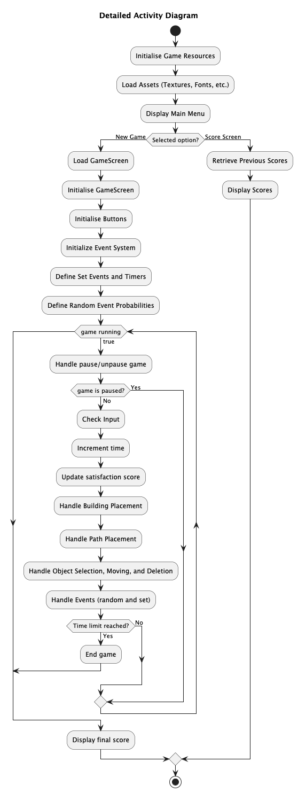
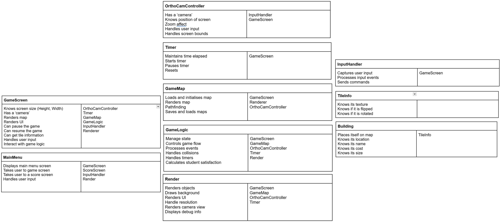
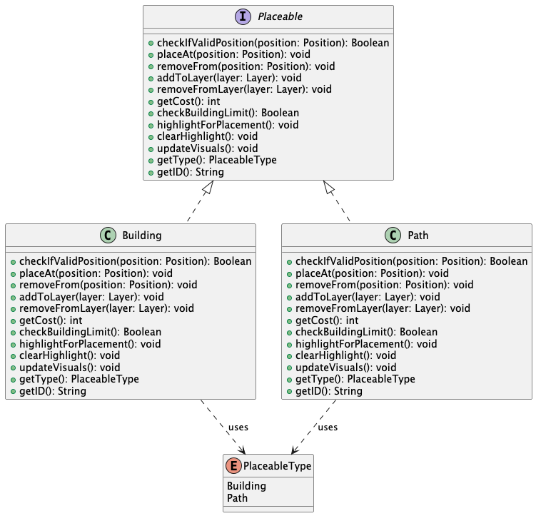
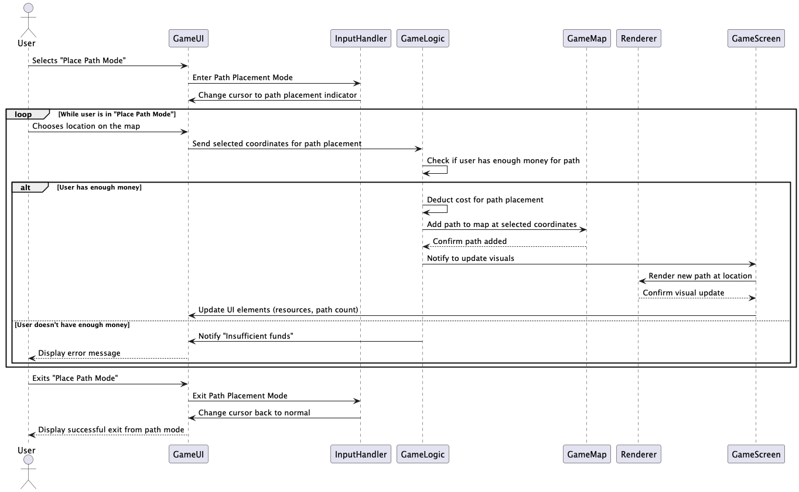
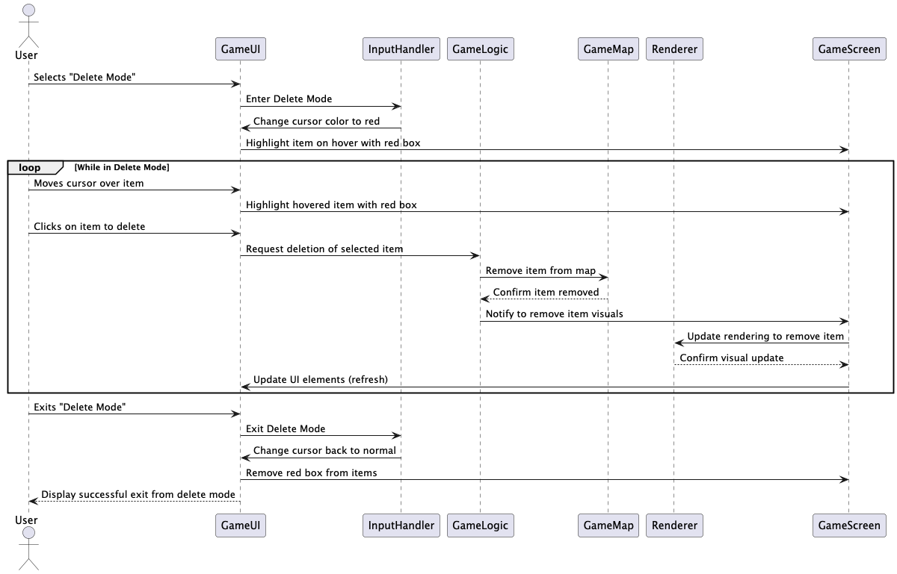
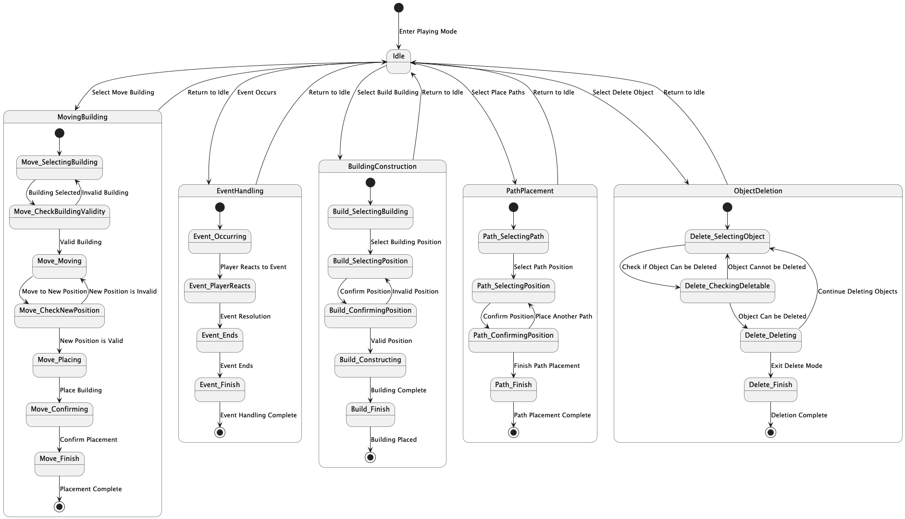

[Back to index](ENG1_index.md)

This page holds all of the deliverables on architecture. 

Main PDF deliverable: 
[Architecture PDF](./assets/pdf/Arch1.pdf) 

# UML diagrams not included on deliverable
These diagrams were not included on the PDF in order to ensure the page limit was not breached.

## 3.3.2 Detailed activity diagram for the game

# Previous design choices

## CRC cards

The above CRC cards demonstrate the initial brainstorming process for the classes to be used for the UniSim game.  

As most of the group were unfamiliar with the LibGDX library, some classes in the above diagram are now no longer in use. For example, it was found that the OrthoCamController was difficult to implement, its responsibilities such as a ‘zoom effect’ not deemed as necessary requirements according to the brief.  

## Previous UML diagrams

### Structural diagrams

#### Placeable interface class diagram

This is a class diagram, it shows the relationships between the Placeable interface, and the Building and Path classes that inherit from it. This explicitly links to the user requirement UR_BUILD and the associated functional requirement FR_COST as it establishes that buildings and paths are placeable objects, and have a getCost() function. We also gave the Placeable interface a checkBuildingLimit(), linking it to UR_LIMIT and FR_MAX_BUILDINGS.

We subsequently decided to update this architecture to be absent of the Placeable interface. We did so upon considering practicality and readability of the code. Where the interface brings the advantages of readability and modularity to the system, we believed that it was unnecessary as those classes meant to inherit from it were way too similar to justify implementing an interface. We believe this improves our code’s readability and conciseness. As an alternative to the interface, we decided to implement different building types by reading json file for list of types and details.

### Behavioural diagrams

#### Place path sequence diagram

This sequence diagram shows the steps involved in placing a path onto the map. This aligns with the UR_BUILD user requirement (allowing the user to place and manage paths as well as buildings). It also links to the functional requirement FR_BUILDING_PLACEMENT as paths can have their positions changed and the FR_COST functional requirement (limits the number of buildings that can be placed through a budget system) is also displayed .

#### Delete mode sequence diagram

This establishes the process in which the system undertakes when the user wants to delete a building/object from the map. It details how the system should enter ‘delete’ mode, updating the UI and user controls accordingly. This explicitly fulfils the functional requirement, FR_BUILDING_DELETION but also implicitly links to the user requirement UR_BUILD, as this states “The game shall allow the user to place and manage several different building types”, and, deleting buildings is considered a constituent of managing them.

#### Game being placed state diagram

This is a general state diagram outlining the behaviour of the whole running system. This explicitly links to UR_BUILD, as it contains a BuildingConstruction event scenario which details the process in which the user goes through to place a building. The diagram subsequently  links to the functional requirements FR_BUILDING_PLACEMENT, as within the BuildingConstruction event scenario the system checks if the proposed position is valid, fulfilling the map constraints check. This diagram also demonstrates how the system fulfils the FR_BUILDING_DELETE requirement via the ObjectDeletion event handler. Finally, a clear link between this diagram and NFR_PREFORMANCE is shown, as this requires the system to appropriately handle the management of buildings shown in the diagram.

