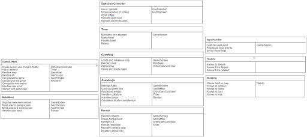

This page holds all of the deliverables on architecture. \

Main PDF deliverable: 
[Architecture PDF](./assets/pdf/Arch1.pdf) \

The above CRC cards demonstrate the initial brainstorming process for the classes to be used for the UniSim game.  

As most of the group were unfamiliar with the LibGDX library, some classes in the above diagram are now no longer in use. For example, it was found that the OrthoCamController was difficult to implement, its responsibilities such as a ‘zoom effect’ not deemed as necessary requirements according to the brief.  

