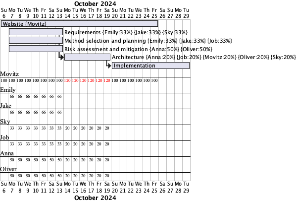
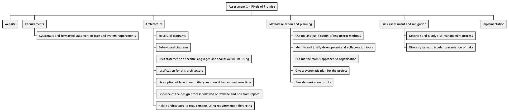

# Deliverables
All of these link to a just a PDF, except implementation which is another page that contains everything required \
[Requirements PDF](./assets/pdf/Req1.pdf) \
[Architecture PDF](./assets/pdf/Arch1.pdf) \
[Method selection and planning PDF](./assets/pdf/Plan1.pdf) \
[Risk assessment and mitigation PDF](./assets/pdf/Risk1.pdf) \
[Implementation page (PDF, Code and JAR)](Implementation.md) \

# Gantt charts and work breakdown structure

## 13/10/24

## Next date
